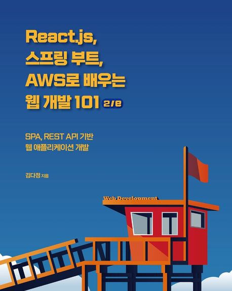

# Todo 애플리케이션 프로젝트

이 저장소는 **김다정** 저자의 책 **React.js, Spring Boot, AWS로 배우는 웹 개발 101**을 따라하며 개발한 코드를 담고 있습니다.

## 프로젝트 개요

이 프로젝트는 **React.js**를 이용한 프론트엔드와 **Spring Boot**를 이용한 백엔드로 구성된 간단한 **Todo 애플리케이션**입니다.  
또한, **JWT**(JSON Web Token)를 활용한 인증 기능이 포함되어 있으며, **AWS Elastic Beanstalk**를 통해 클라우드 환경에서 배포되었습니다.

### 주요 기능

1. **할 일(Task)에 대한 CRUD** (생성, 조회, 수정, 삭제) 기능 제공.
2. 프론트엔드와 백엔드 간 **REST API**를 통한 통신.
3. **JWT** 기반의 **인증 시스템**을 구현하여, 로그인한 사용자만 할 일을 관리할 수 있도록 설정.
4. **AWS Elastic Beanstalk**를 이용한 클라우드 배포.

### 사용된 기술

- **React.js**: 사용자 인터페이스 구축 및 클라이언트 측 라우팅 관리.
- **Spring Boot**: 백엔드 API 개발, 데이터베이스 연결 및 비즈니스 로직 처리.
- **JWT 인증**: 사용자 인증 및 보안 강화를 위해 JWT 기반 인증 시스템 적용.
- **AWS Elastic Beanstalk**: 애플리케이션의 클라우드 배포 및 호스팅.

